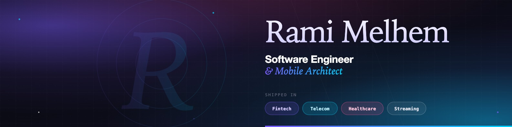

<!-- Profile README for github.com/Hackino -->

<!-- ============================================================ -->
<!--  Banner                                                       -->
<!-- ============================================================ -->
<p align="center">
  
</p>

<!-- ============================================================ -->
<!--  Identity                                                     -->
<!-- ============================================================ -->
<h1 align="center">Rami Melhem</h1>

<p align="center">
  
</p>

<p align="center">
  <a href="https://www.linkedin.com/in/rami-m-melhem"></a>
  <a href="https://x.com/rami_melhem_dev"></a>
  <a href="https://www.instagram.com/rami_melhem_dev/"></a>
  <a href="mailto:rami.m.melhem@gmail.com"></a>
  
</p>

<p align="center">
  
  
</p>

<br />

<!-- ============================================================ -->
<!--  About                                                        -->
<!-- ============================================================ -->
## &nbsp;◢&nbsp; About

Software engineer working across mobile and web — I design and ship production systems with clean architecture, predictable state, and codebases that survive the second release. I care about the boring parts: build pipelines, crash-free sessions, and the gap between a feature spec and what users actually tap.

- 🏗️ &nbsp;**Mobile architect** — clean architecture, MVVM/MVI, modularization, dependency inversion
- 📱 &nbsp;**Mobile** — native and cross-platform, single codebase to multi-platform delivery
- 🌐 &nbsp;**Full-Stack** — web frontends, REST/GraphQL APIs, auth, and database design
- 🧪 &nbsp;**Quality-first** — TDD, CI/CD, Crashlytics observability
- 🏢 &nbsp;**Shipped in** — Fintech, Telecom, Healthcare, Streaming
- 🤝 &nbsp;**Open to** — platform engineering, mobile or web product work, technical reviews, and well-scoped contracts

<br />

<!-- ============================================================ -->
<!--  Tech                                                         -->
<!-- ============================================================ -->
## &nbsp;◢&nbsp; Tech Stack

<table>
  <tr>
    <td valign="top" width="33%">

#### 📱 Mobile


</td>
    <td valign="top" width="33%">

#### 🛠️ Engineering


</td>
    <td valign="top" width="33%">

#### 🧠 Backend & Web


</td>
  </tr>
  <tr>
    <td valign="top">

#### 🧪 Quality


</td>
    <td valign="top">

#### 🎨 Design / UX


</td>
    <td valign="top">

#### ☁️ Platform


</td>
  </tr>
</table>

<br />

<!-- ============================================================ -->
<!--  Industries                                                   -->
<!-- ============================================================ -->
## &nbsp;◢&nbsp; Shipped In

<p align="center">
  &nbsp;
  &nbsp;
  &nbsp;
  
</p>

<br />

<!-- ============================================================ -->
<!--  Principles                                                   -->
<!-- ============================================================ -->
## &nbsp;◢&nbsp; How I Work

```kotlin
object Engineering {
    val principles = listOf(
        "Architecture before frameworks",
        "Predictable state, explicit side effects",
        "Test what users feel, not what code does",
        "Small modules, hard boundaries",
        "Ship the boring infrastructure first",
    )

    fun ship(idea: Idea): Product = idea
        .scope()
        .architect()
        .prototype()
        .iterate(withFeedback = true)
        .harden()
        .release()
}
```

<br />

<!-- ============================================================ -->
<!--  Currently                                                    -->
<!-- ============================================================ -->
## &nbsp;◢&nbsp; Currently

- 🌱 &nbsp;Deepening **Kotlin Multiplatform** and **Compose Multiplatform**
- 🌐 &nbsp;Expanding into **backend & web** — **Next.js** for web, **C# / .NET** across backend and web
- 🍃 &nbsp;Building **Spring Boot** services on the side — APIs, auth, and side-project backends
- 🤖 &nbsp;Exploring agent-driven development workflows with Claude Code
- 🤝 &nbsp;Supporting the team on architecture decisions, code reviews, and clean-code practices

<br />

<!-- ============================================================ -->
<!--  Connect                                                      -->
<!-- ============================================================ -->
## &nbsp;◢&nbsp; Let's Connect

<p>
If you're building something interesting in mobile or web — or you just want to trade architecture notes — the inbox is open.
</p>

<p>
  <a href="https://www.linkedin.com/in/rami-m-melhem"></a>
  <a href="https://x.com/rami_melhem_dev"></a>
  <a href="https://www.instagram.com/rami_melhem_dev/"></a>
  <a href="mailto:rami.m.melhem@gmail.com"></a>
</p>

<br />

<!-- ============================================================ -->
<!--  Footer                                                       -->
<!-- ============================================================ -->
<p align="center">
  
</p>
